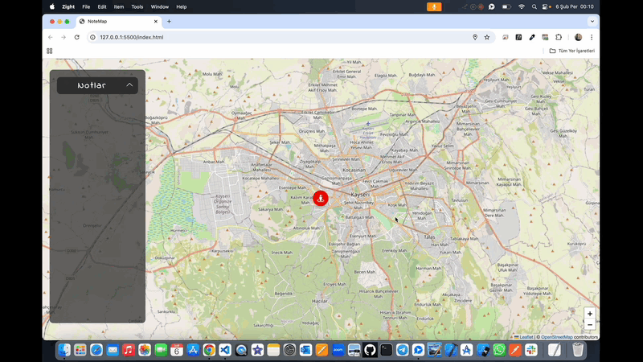

# NoteMap 🗺️

<li>Bu proje HTML,CSS,JS,LEAFLET ile oluşturulmuş Gezici Harita İşaretleyicisi içerir.</li>
<li>Proje kişilerin konum bilgisini alarak iconlar yardımıyla harita üzerinde işaretleme,ekleme,silme özelliği sunar.</li>
<li>Modern ve kullanıcı dostu arayüze sahiptir.</li>

# Kullanılan Teknolojiler 🎨

<li>HTML</li>
<li>CSS</li>
<li>JS</li>
<li>LEAFLET</li>

# Ekran Görüntüsü 🎥
      

# İletişim 📩
yunusemreoral@hotmail.com.tr
